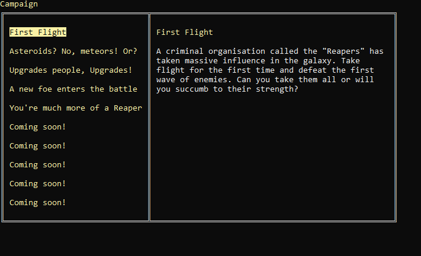

# Space Invaders on Console

Welcome to my Space Invaders Console Game remake! This is a simple project letting you play a new vision of the game on a console application with an ACII art style

## Features
- Simple and intuitive controls.
- 4 dimensional movement
- ship upgrades
- an endless mode that gets harder and harder
- a menu that is navigatable by WASD, space and escape

## Upcoming/planned
- campaign
- ingame wiki
- more enemies
- boss fights

## How to Play
Download the repo and execute the project yourself

## Screenshots

## Contributing
Contributions are welcome! If you'd like to improve the game or add new features, feel free to fork the repository and submit a pull request with your changes.

Enjoy playing the game!
